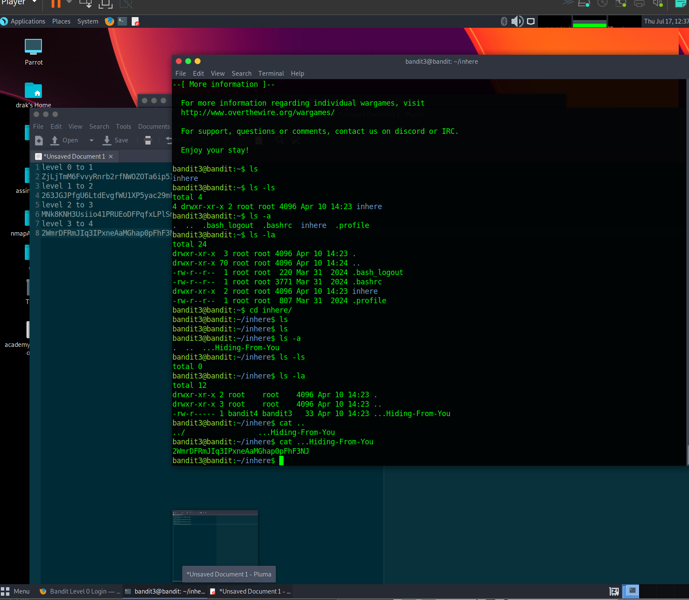
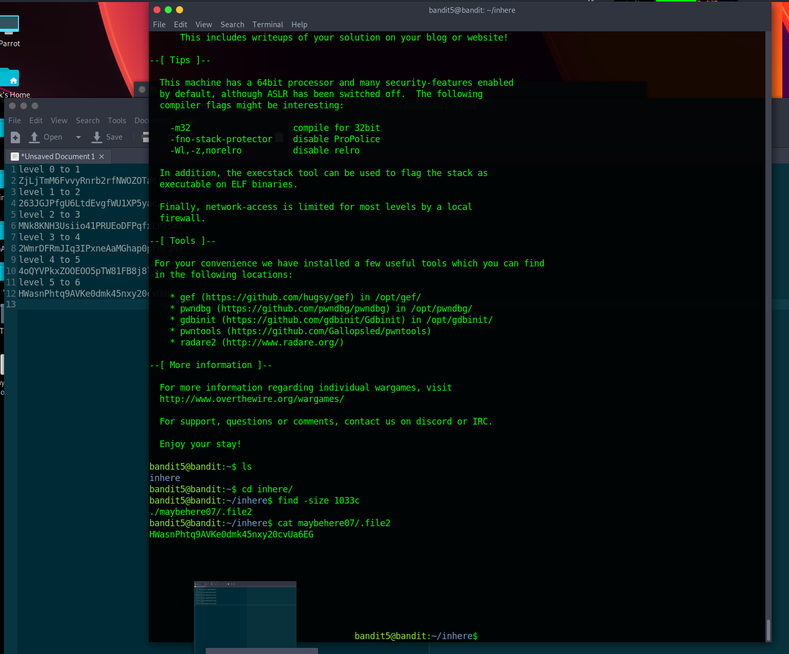
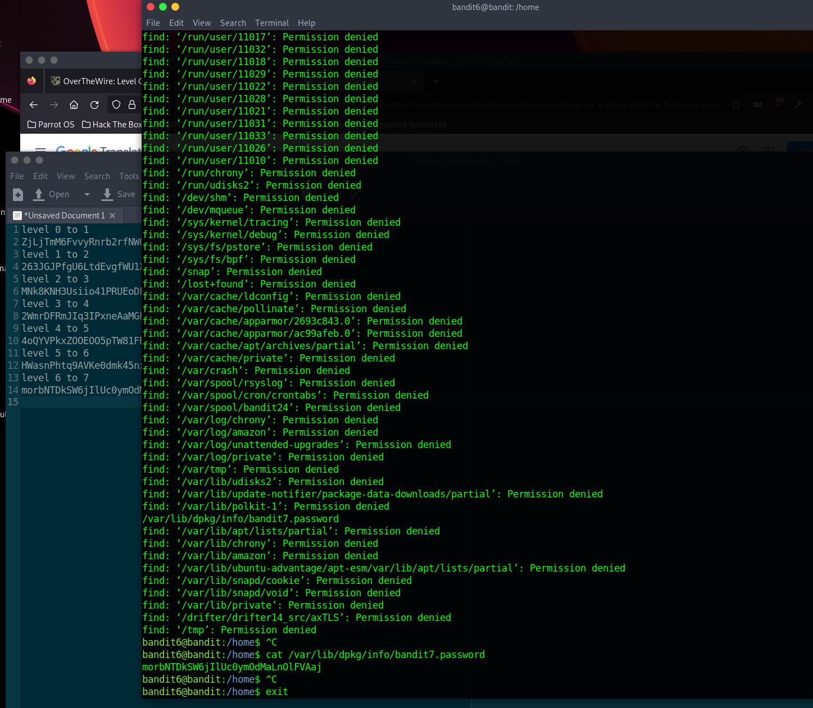
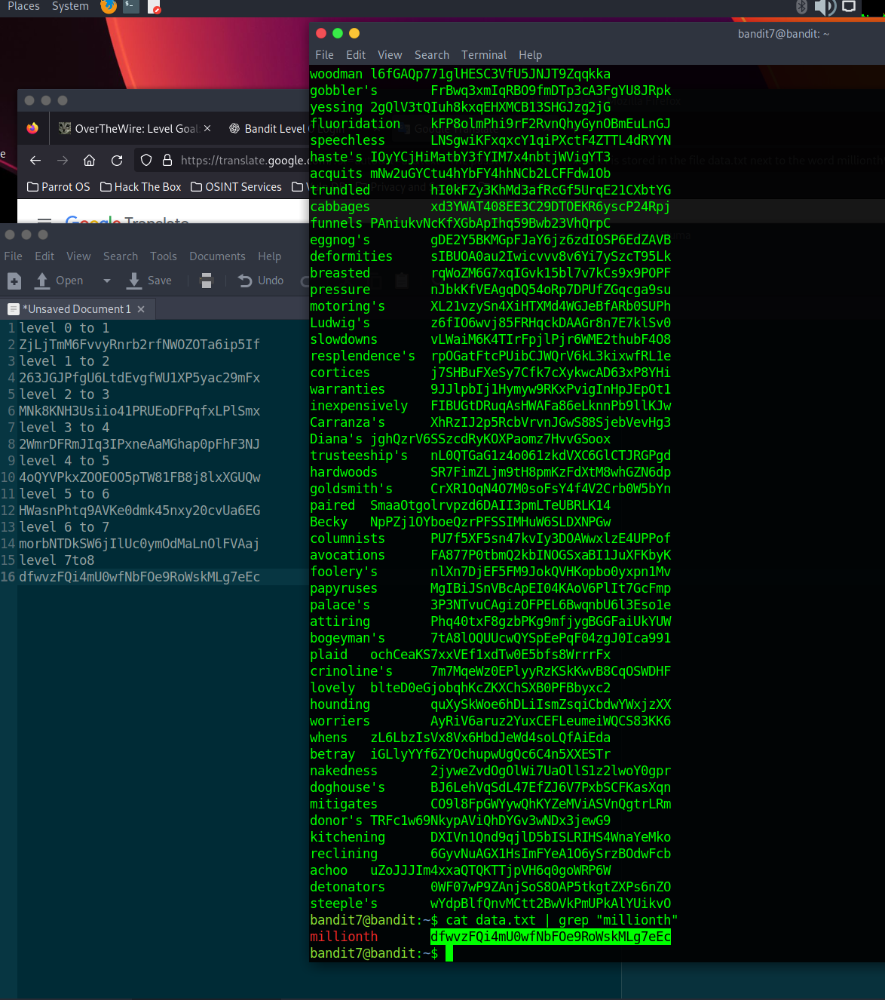
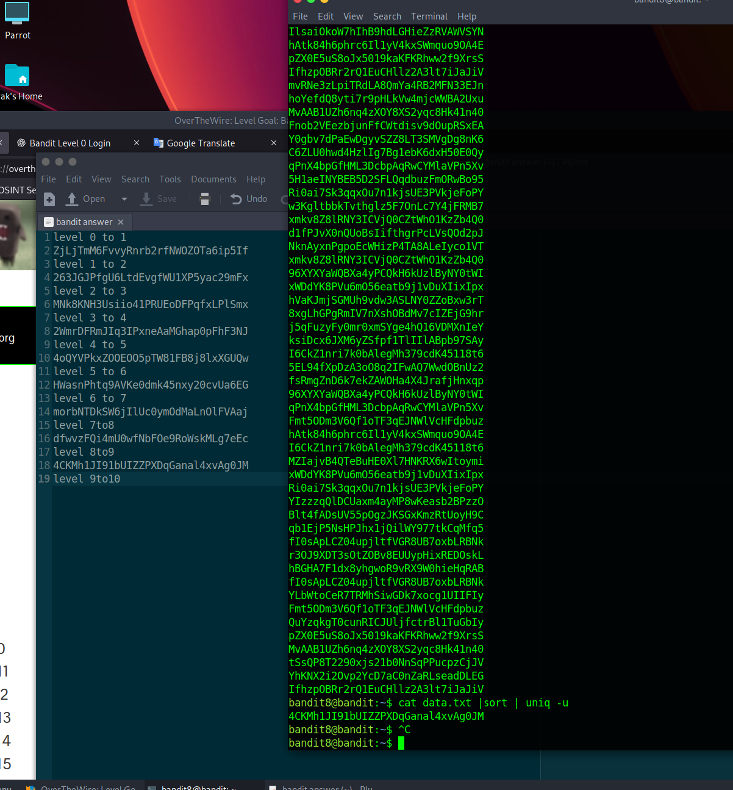
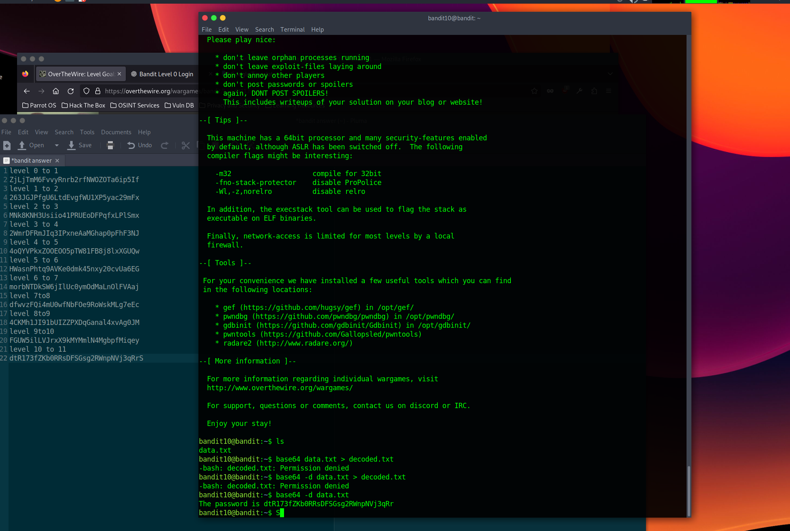
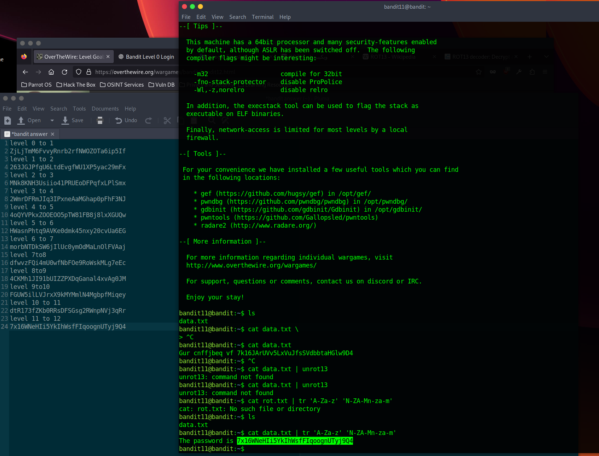

<!DOCTYPE html>
<html lang="en">
<head>
  <meta charset="UTF-8"></head>
<body>
  <h1>Labs answer</h1>
  

    
    
    
    
    
    
    
    
    
    
    
    
    
    
    
    
    
    
    
    
    
    
    
    
    
    
    
    
    
  

</body>
</html>
