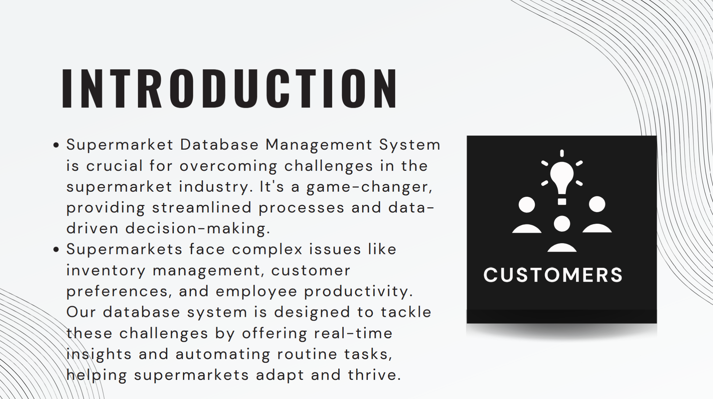
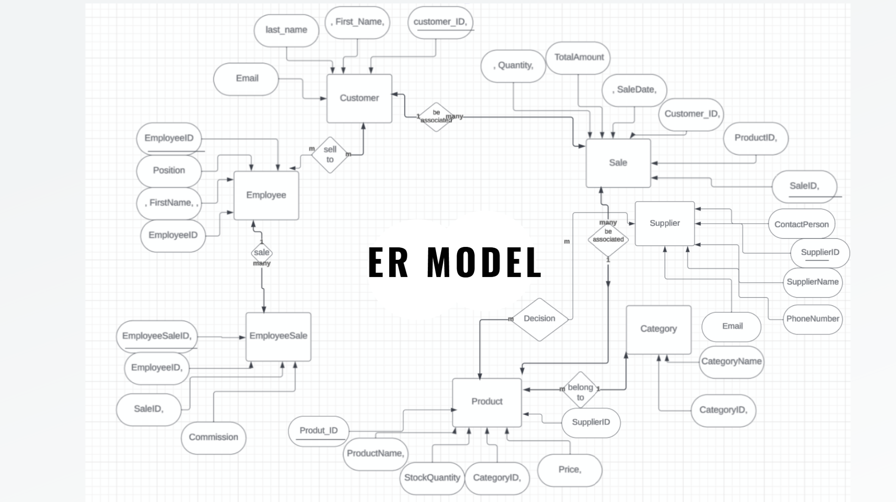
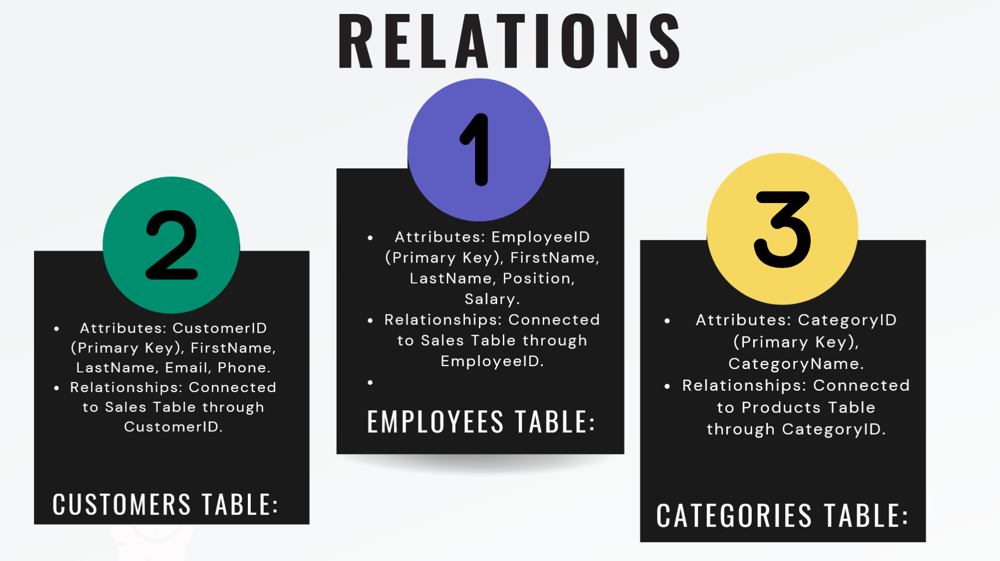
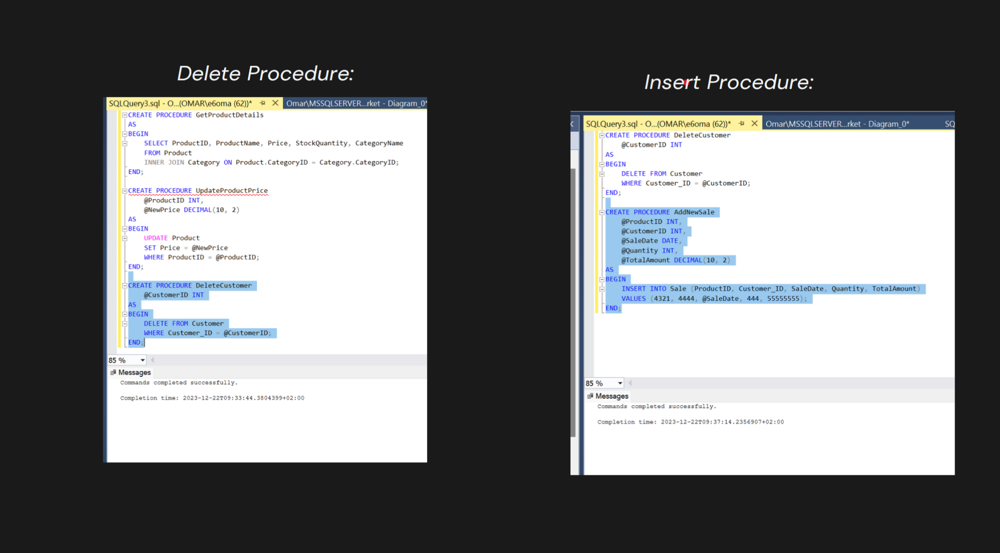
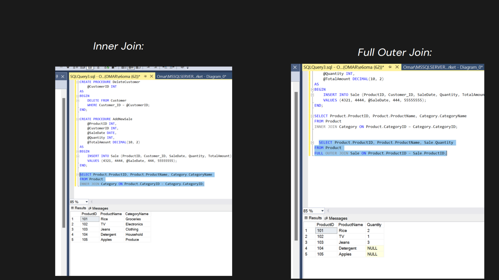

<!DOCTYPE html>
<html lang="en">
<head>
  <meta charset="UTF-8">
</head>
<body>
  <h1>📑 Project Preview</h1>
  
Below is a visual preview of the project pages 

  

   
   
   
   
   
   
   
   
   
   
   
   
   
   

  

  
© 2025 - All rights reserved.

</body>
</html>
